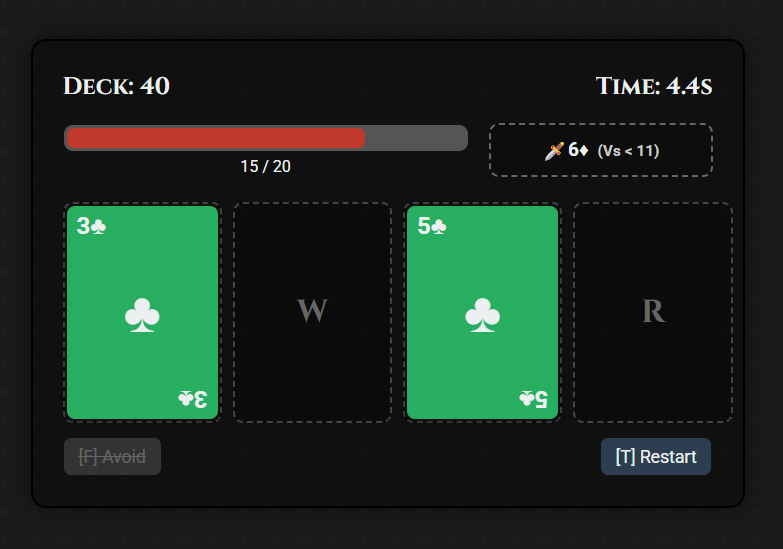

# Scoundrel - A Single-File Card Game

A responsive, single-file HTML implementation of the classic solo card game **Scoundrel** by Zach Gage and Kurt Bieg. This version is built with vanilla HTML, CSS, and JavaScript, focusing on speed, responsiveness, and adherence to the official rules.

## 🚀 Play the Game

This game is hosted on GitHub Pages and can be played directly in your browser. No download is required.

### [**Click Here to Play!**](https://jirkaoriginal.github.io/Scoundrel-Speedrun-Edition/)

## ✨ Features

*   **Single File, Zero Dependencies**: The entire game is contained in a single `.html` file. No builds, no frameworks.
*   **Fully Responsive**: The layout seamlessly adapts from desktop to mobile, ensuring a great experience on any device.
*   **Dual Control Scheme**: Play with keyboard shortcuts (`QWER`, `F`, `T`) for speed or use the intuitive mouse/touch controls.
*   **Rules-Accurate Gameplay**: Implements the official 1.0 ruleset, including turn structure, weapon limitations, and end-game scoring.

## 🤖 AI-Assisted Development

This project was developed in collaboration with Google's Gemini AI. 
The primary goal was to rapidly prototype and build a fully-functional, polished game that "just works" out of the box. 
Using an AI assistant allowed for an efficient workflow, going from concept to a complete, playable, 
and responsive product in a very short amount of time.

## ⌨️ Controls

| Action              | Keyboard | Mouse / Touch              |
| ------------------- | :------: | -------------------------- |
| **Play Card 1-4**   | `QWER`   | Click on a card            |
| **Avoid the Room**  |   `F`    | Click the **[F] Avoid** button |
| **Restart the Game**|   `T`    | Click the **[T] Restart** button |

## 📜 Game Rules Summary

Your goal is to survive by making it through the entire dungeon deck.

*   **The Turn**: Each turn, you are presented with a **Room** of four cards. You must face **3 of the 4 cards**. The last remaining card stays for the next room.
*   **Monsters (♣ & ♠)**: Deal damage equal to their value (J=11, Q=12, K=13, A=14).
*   **Weapons (♦)**: Reduce monster damage. A weapon can only be used on monsters of a value *strictly lower* than the previous monster it defeated.
*   **Potions (♥)**: Restore health. You can only use **one** potion per room. Health cannot exceed 20.
*   **Avoiding a Room**: Before playing a card, you can move all 4 cards to the bottom of the deck. You cannot do this twice in a row.

## 🛠️ Tech Stack

*   **Vanilla HTML**: For the content structure.
*   **Vanilla CSS**: For styling and the responsive layout.
*   **Vanilla JavaScript (ES6)**: For all game logic.

## 📄 License

This project is licensed under the MIT License.
